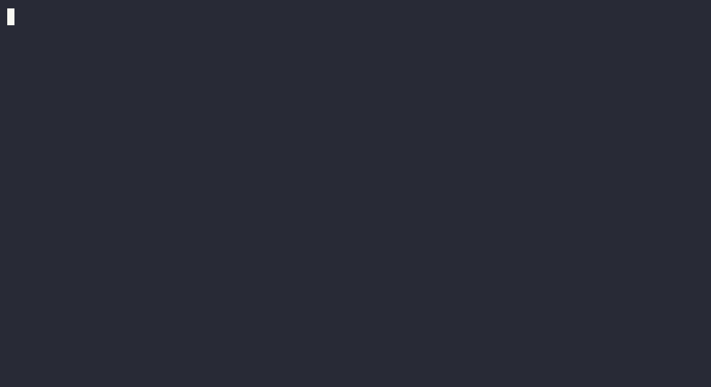

# giroux.nvim

[](https://github.com/sameigen/giroux.nvim/actions/workflows/ci.yml)


The captain for your Claude Code agents. Named for the Flyers legend —
opinionated, Claude-only, no abstraction layer.



From one Neovim, observe and steer every Claude Code session across your
Tailscale network: the live transcript, every tool call, every bash command,
every diff — *more* visibility than the TUI itself gives you, never less.
Observation is lossless and non-invasive: giroux tails session transcripts;
it never gets between the agent and its work.

Companion to [parole.nvim](https://github.com/sameigen/parole.nvim):
giroux supervises the work, parole reviews it for release.

## The point

Wrappers die because they hide the tool calls. Giroux's core bet is the
opposite: the session transcript (`~/.claude/projects/**/<session>.jsonl`)
is a lossless feed of everything the agent does — full bash commands and
their output, edit diffs, web fetches, thinking, token spend. Giroux renders
that feed live, proves agent state from transcript + process evidence, and
(soon) makes steering a deliberate, in-editor act.

## Commands

| Command | What |
|---|---|
| `:Giroux` | The roster — every session on every node, live, attention-sorted |
| `:GirouxFeed [session]` | Live lossless feed (tool calls fold open, follows the tail) |
| `:GirouxQA [session]` | Q&A digest — your turns + answers, tool calls collapsed |
| `:GirouxDispatch` | New agent: node → repo → optional worktree → tmux + claude |
| `:GirouxAttach [session]` | Take over a session's TUI in a terminal tab |
| `:GirouxSteer [session]` | Queue a message into a session (`:w` sends) |
| `:GirouxClean [node]` | Reap detached giroux sessions idle > 30m |

### Roster keys
`<CR>` feed · `n` dispatch · `a` attach · `s` steer · `R` resume (dead) ·
`S` stat sheet · `Q` digest · `r` refresh · `q` close.
A `▸` marks a **steerable** session (live tmux); blank is observe-only.

### Feed keys
`<Tab>` fold · `K` peek line · `]]`/`[[` jump turns · `a` attach · `s` steer ·
`<CR>` drill into a subagent, or answer the live question option · `Q` digest · `q` close

## Capture (optional but recommended)

Source the wrapper so interactive `claude` sessions you start by hand land in
tmux and become steerable (headless/`-p` runs are untouched):

```sh
# ~/.zshrc
[ -f ~/path/to/giroux.nvim/scripts/claude-wrapper.zsh ] && source ~/path/to/giroux.nvim/scripts/claude-wrapper.zsh
```

## Status

Watch and steer planes are built and tested (58 specs; the JSONL parser is
gauntleted against 270+ real transcripts, 0 crashes). Design rationale lives
in [DESIGN.md](DESIGN.md), the build map in [ARCHITECTURE.md](ARCHITECTURE.md),
the phased plan in [PLAN.md](PLAN.md).

## Requirements

- Neovim ≥ 0.11, with `ssh` and `tmux` available
- **macOS nodes only, for now.** Discovery uses BSD `stat`/`tail`, so giroux
  works against macOS machines today; Linux support is [planned](PLAN.md).
  `:checkhealth giroux` flags a node it can't support.

## Setup

Configure the nodes to supervise:

```lua
require("giroux").setup({
  nodes = { workhorse = { host = "workhorse" } }, -- honors ~/.ssh/config
  tripwires = { read = { "**/legacy/**" } },  -- ping when an agent reads stale code
})
```

For headless/remote auth on macOS, export `CLAUDE_CODE_OAUTH_TOKEN` (from
`claude setup-token`) in the node's `~/.zshenv` — the login keychain is
locked in non-GUI SSH sessions.

## Tests

```
nvim -l tests/run.lua       # unit + integration specs
nvim -l scripts/smoke.lua   # every module loads, config merges
```
